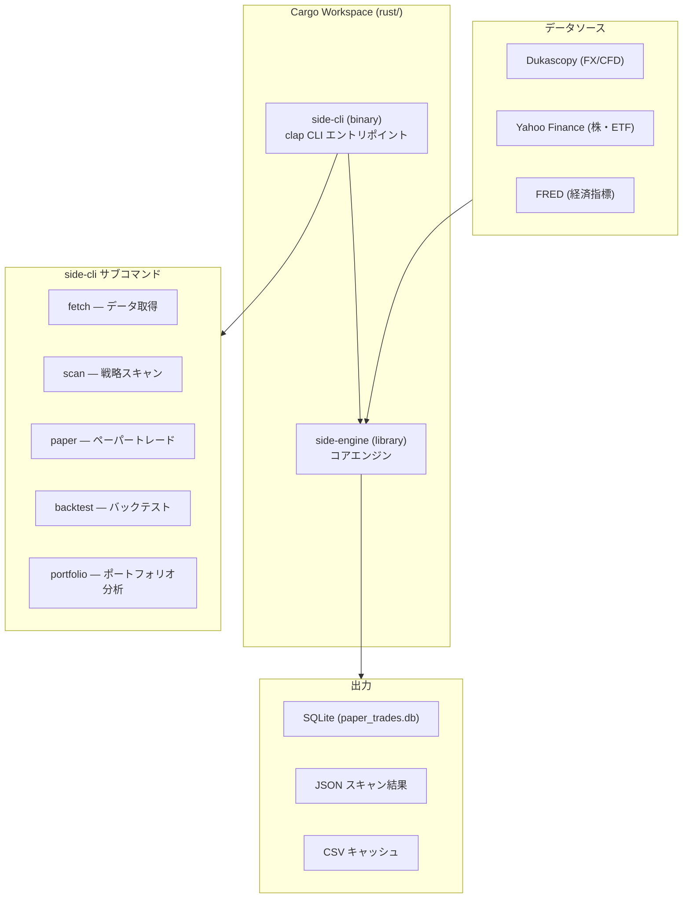
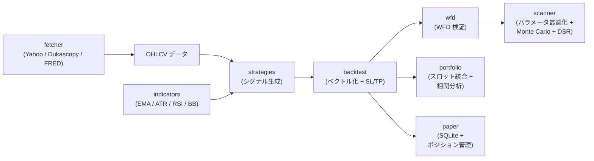

# side

(ほぼ)Rustで書かれたシステマティック・トレーディングCLI。

Crypto (CCXT/Dukascopy/yfinance) / FX/CFD 対応、戦略定義 → データ取得 → バックテスト → WFD検証 → ペーパートレード を一気通貫で行う。

## アーキテクチャ



## モジュール構成とデータフロー



## セットアップ

**必要なもの:** Rust ツールチェーン (`cargo`)、Python 3.12+ & [uv](https://github.com/astral-sh/uv)（Yahoo Finance データ取得に使用）。

```bash
# ビルド
cd rust && cargo build --release

# バイナリ
./rust/target/release/side --help
```

**環境変数 (オプション):**

| 変数 | 用途 |
|------|------|
| `ANTHROPIC_API_KEY` | AI 分析機能 |
| `BINANCE_API_KEY` / `BINANCE_SECRET` | ライブ取引連携 |

## 使い方

```bash
# データ取得 (Dukascopy: デフォルト)
side fetch --asset EURUSD --timeframe 1h --days 30

# データ取得 (Yahoo Finance)
side fetch --asset EURUSD --source yahoo --timeframe 1h --days 90

# バックテスト
side backtest --asset EURUSD --strategy ema_atr --timeframe 1h

# 戦略スキャン (パラメータ最適化 + WFD)
side scan --asset EURUSD --timeframe 1h --trials 200

# 複数資産スキャン
side scan --asset EURUSD,USDJPY,GBPUSD --timeframe 1h --strategies ema_atr,sma_cross

# ペーパートレーディング (デーモン起動)
side paper --config config/paper_slots.json

# ペーパートレーディング (シングルティック)
side paper --once

# ポートフォリオ分析
side portfolio --db data/paper_trades.db --analyze
```

## 戦略一覧

| 戦略名 | 概要 |
|--------|------|
| `sma_cross` | 短期/長期 SMA のゴールデン・デッドクロス |
| `ema_atr` | EMA クロス + ATR フィルター |
| `donchian_breakout` | ドンチャンチャネルのブレイクアウト |
| `dual_momentum` | 絶対・相対モメンタムの組み合わせ |
| `bb_squeeze` | ボリンジャーバンド収縮後のブレイク |
| `bb_pctb` | ボリンジャーバンド %b による逆張り |
| `rsi_reversal` | RSI 過買い・過売りからの反転 |
| `macd_hist` | MACD ヒストグラムのゼロクロス |
| `keltner` | ケルトナーチャネルのブレイクアウト |
| `momentum_roc` | ROC (Rate of Change) モメンタム |
| `vol_breakout` | ボラティリティ拡大時のブレイクアウト |
| `parkinson` | Parkinson ボラティリティ推定 |
| `session_momentum` | セッション別モメンタム (東京/ロンドン/NY) |
| `seasonal_filter` | 季節性フィルター |
| `cross_asset_fx` | クロスアセット相関 FX 戦略 |
| `dxy_mean_reversion` | DXY 連動の平均回帰 |
| `month_end_jpy` | 月末 JPY フロー効果 |

## ディレクトリ構成

```
rust/
  Cargo.toml              — ワークスペースマニフェスト
  side-engine/            — コアライブラリクレート
    src/
      lib.rs              — モジュールエクスポート
      strategies.rs       — 17 トレーディング戦略
      backtest.rs         — バックテストエンジン (ベクトル化 + SL/TP)
      wfd.rs              — Walk-Forward Development
      indicators.rs       — テクニカル指標 (EMA, ATR, RSI, BB 他)
      portfolio.rs        — ポートフォリオ分析 (曲線合成・メトリクス・相関)
      fetcher/            — データソース (Yahoo, Dukascopy, FRED, キャッシュ)
      scanner/            — 戦略スキャナー (多目的最適化, Monte Carlo, DSR)
      paper/              — ペーパートレーダー (SQLite, ポジション管理)
    tests/                — インテグレーションテスト
  side-cli/               — CLI バイナリクレート
    src/
      main.rs             — Clap CLI エントリポイント
      cmd/                — サブコマンド実装 (fetch, scan, paper, backtest, portfolio)
  config/
    param_spaces.json     — 戦略パラメータ探索空間定義
data/                     — キャッシュ・スキャン結果 (gitignore)
scripts/                  — リサーチ・ユーティリティスクリプト
```

## 開発

```bash
# 全テスト実行
cargo test

# エンジンテストのみ
cargo test -p side-engine

# lint
cargo clippy

# フォーマット
cargo fmt
```

## License

License not yet specified.
